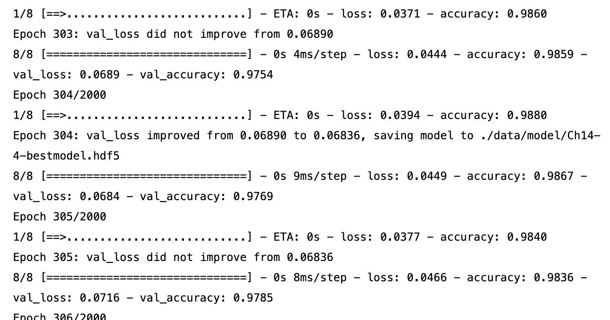
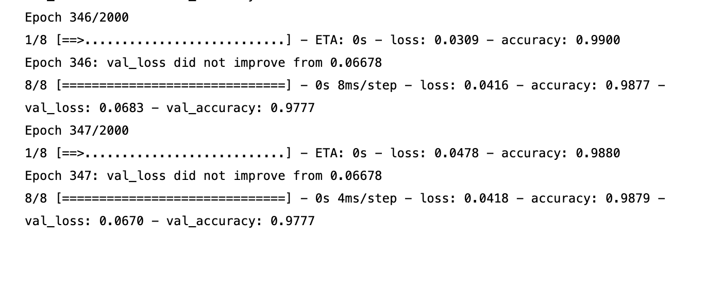

# **컴퓨터정보과 3학년 A반 202044021 이준혁**

> # **11주차**

## 타이타닉

코드  
  

 

모델 1 출력결과  
  

 

모델 2 출력결과
  

 
 

## 패션

모델 1 코드  
  

 

모델 1 출력결과  
  

 

모델 2 코드  
  

 

모델 2 출력결과  
  

 
 

## 와인 종류 예측하기  

model이 마지막으로 저장 되는 부분  
  

 

학습이 종료되는 부분의 출력 결과  
  

 

test 결과 accuracy
  